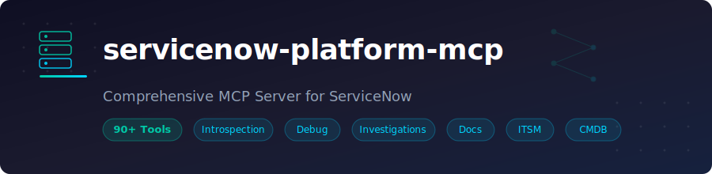

<p align="center">
  
</p>

<p align="center">
  <a href="https://pypi.org/project/servicenow-devtools-mcp/"></a>
  <a href="https://pypi.org/project/servicenow-devtools-mcp/"></a>
  <a href="https://github.com/xerrion/servicenow-devtools-mcp/blob/main/LICENSE"></a>
  
</p>

# servicenow-devtools-mcp

A developer & debug-focused [Model Context Protocol (MCP)](https://modelcontextprotocol.io/) server for ServiceNow. Give your AI agent direct access to your ServiceNow instance for introspection, debugging, change intelligence, ITIL process management, and documentation generation.

## Features

- :mag: **Instance Introspection** -- describe tables, query records, compute aggregates, fetch individual records
- :link: **Relationship Mapping** -- find incoming and outgoing references for any record
- :package: **Change Intelligence** -- inspect update sets, diff artifact versions, audit trails, generate release notes
- :bug: **Debug & Trace** -- trace record timelines, flow executions, email chains, integration errors, import set runs, field mutations
- :test_tube: **Record CRUD** -- create, update, delete records with direct or preview-then-apply patterns
- :wrench: **Developer Utilities** -- toggle artifacts on/off, set system properties
- :mag_right: **Investigations** -- 7 built-in analysis modules (stale automations, deprecated APIs, table health, ACL conflicts, error analysis, slow transactions, performance bottlenecks)
- :page_facing_up: **Documentation** -- generate logic maps, artifact summaries, test scenarios, code review notes
- :gear: **Workflow Analysis** -- list workflow versions, inspect contexts, map activity structures, trace execution status
- :fire_engine: **Incident Management** -- list, create, update, resolve incidents and add comments
- :arrows_counterclockwise: **Change Management** -- manage change requests, change tasks, and approvals
- :warning: **Problem Management** -- track problems through root cause analysis to resolution
- :globe_with_meridians: **CMDB** -- browse configuration items, relationships, classes, and health checks
- :inbox_tray: **Request Management** -- manage service requests and request items (RITMs)
- :books: **Knowledge Management** -- search, create, update articles and submit feedback
- :shopping_cart: **Service Catalog** -- browse catalogs, categories, items, manage cart, and place orders
- :shield: **Safety** -- table deny lists, sensitive field masking, row limit caps, write gating in production

---

## Quick Start

```bash
# No install needed -- run directly with uvx
uvx servicenow-devtools-mcp
```

Set three required environment variables (or use a `.env` file):

```bash
export SERVICENOW_INSTANCE_URL=https://your-instance.service-now.com
export SERVICENOW_USERNAME=admin
export SERVICENOW_PASSWORD=your-password
```

---

## Configuration

### OpenCode

Add to `~/.config/opencode/opencode.json`:

```json
{
  "mcp": {
    "servicenow": {
      "type": "local",
      "command": ["uvx", "servicenow-devtools-mcp"],
      "environment": {
        "SERVICENOW_INSTANCE_URL": "https://your-instance.service-now.com",
        "SERVICENOW_USERNAME": "admin",
        "SERVICENOW_PASSWORD": "your-password",
        "MCP_TOOL_PACKAGE": "full",
        "SERVICENOW_ENV": "dev"
      }
    }
  }
}
```

### Claude Desktop

Add to your Claude Desktop config (`claude_desktop_config.json`):

```json
{
  "mcpServers": {
    "servicenow": {
      "command": "uvx",
      "args": ["servicenow-devtools-mcp"],
      "env": {
        "SERVICENOW_INSTANCE_URL": "https://your-instance.service-now.com",
        "SERVICENOW_USERNAME": "admin",
        "SERVICENOW_PASSWORD": "your-password",
        "MCP_TOOL_PACKAGE": "full",
        "SERVICENOW_ENV": "dev"
      }
    }
  }
}
```

### VS Code / Cursor (Copilot MCP)

Add to `.vscode/mcp.json` in your workspace:

```json
{
  "servers": {
    "servicenow": {
      "command": "uvx",
      "args": ["servicenow-devtools-mcp"],
      "env": {
        "SERVICENOW_INSTANCE_URL": "https://your-instance.service-now.com",
        "SERVICENOW_USERNAME": "admin",
        "SERVICENOW_PASSWORD": "your-password",
        "MCP_TOOL_PACKAGE": "full",
        "SERVICENOW_ENV": "dev"
      }
    }
  }
}
```

### Generic stdio

```bash
SERVICENOW_INSTANCE_URL=https://your-instance.service-now.com \
SERVICENOW_USERNAME=admin \
SERVICENOW_PASSWORD=your-password \
uvx servicenow-devtools-mcp
```

---

## :robot: Install Instructions for AIs

> Copy the block below and paste it into a conversation with any AI agent that supports MCP tool use. The AI will know how to configure and use this server.

````text
## ServiceNow MCP Server Setup

You have access to a ServiceNow MCP server (`servicenow-devtools-mcp`) that provides
86 tools for interacting with a ServiceNow instance.

### Installation

Run via uvx (no install required):
```
uvx servicenow-devtools-mcp
```

### Required Environment Variables

- SERVICENOW_INSTANCE_URL -- Full URL of the ServiceNow instance (e.g. https://dev12345.service-now.com)
- SERVICENOW_USERNAME -- ServiceNow user with admin or appropriate roles
- SERVICENOW_PASSWORD -- Password for the user above

### Optional Environment Variables

- MCP_TOOL_PACKAGE -- Which tools to load (default: "full"). See Tool Packages section for all 14 options.
- SERVICENOW_ENV -- Environment label: "dev" (default), "test", "staging", "prod". Write operations are blocked when set to "prod" or "production".
- MAX_ROW_LIMIT -- Max records per query (default: 100, max: 10000)
- LARGE_TABLE_NAMES_CSV -- Tables requiring date-bounded queries (default: syslog,sys_audit,sys_log_transaction,sys_email_log)

### MCP Client Configuration (stdio transport)

```json
{
  "command": "uvx",
  "args": ["servicenow-devtools-mcp"],
  "env": {
    "SERVICENOW_INSTANCE_URL": "<instance_url>",
    "SERVICENOW_USERNAME": "<username>",
    "SERVICENOW_PASSWORD": "<password>",
    "MCP_TOOL_PACKAGE": "full",
    "SERVICENOW_ENV": "dev"
  }
}
```

### Available Tools (86 total)

**Introspection (4):** table_describe, table_get, table_query, table_aggregate
  - Describe table schema, fetch records by sys_id, query with encoded queries, compute stats

**Relationships (2):** rel_references_to, rel_references_from
  - Find what references a record and what a record references

**Metadata (4):** meta_list_artifacts, meta_get_artifact, meta_find_references, meta_what_writes
  - List/inspect platform artifacts (business rules, script includes, etc.), find cross-references, find writers to a table

**Change Intelligence (4):** changes_updateset_inspect, changes_diff_artifact, changes_last_touched, changes_release_notes
  - Inspect update sets, diff artifact versions, view audit trail, generate release notes

**Debug & Trace (6):** debug_trace, debug_flow_execution, debug_email_trace, debug_integration_health, debug_importset_run, debug_field_mutation_story
  - Build event timelines, inspect flow executions, trace emails, check integration errors, inspect import sets, trace field mutations

**Record CRUD (7):** record_create, record_preview_create, record_update, record_preview_update, record_delete, record_preview_delete, record_apply
  - Create, update, delete records directly or via preview-then-apply confirmation pattern

**Developer Utilities (2):** dev_toggle, dev_set_property
  - Toggle artifacts on/off, set system properties

**Investigations (2 dispatchers, 7 modules):** investigate_run, investigate_explain
  - Modules: stale_automations, deprecated_apis, table_health, acl_conflicts, error_analysis, slow_transactions, performance_bottlenecks

**Documentation (4):** docs_logic_map, docs_artifact_summary, docs_test_scenarios, docs_review_notes
  - Generate automation maps, artifact summaries with dependencies, test scenario suggestions, code review findings

**Query Builder (1):** build_query
  - Build structured ServiceNow encoded queries from JSON conditions, returns reusable query tokens

**Workflow Analysis (5):** workflow_contexts, workflow_map, workflow_status, workflow_activity_detail, workflow_version_list
  - List workflow contexts for a record, map workflow structure, inspect execution status, view activity details

**Incident Management (6):** incident_list, incident_get, incident_create, incident_update, incident_resolve, incident_add_comment
  - Full incident lifecycle: list, fetch, create, update, resolve, and add comments/work notes

**Change Management (6):** change_list, change_get, change_create, change_update, change_tasks, change_add_comment
  - Manage change requests: list, fetch, create, update, view tasks, and add comments/work notes

**Problem Management (5):** problem_list, problem_get, problem_create, problem_update, problem_root_cause
  - Problem lifecycle: list, fetch, create, update, and document root cause analysis

**CMDB (5):** cmdb_list, cmdb_get, cmdb_relationships, cmdb_classes, cmdb_health
  - Browse CIs, inspect relationships, list CI classes, check CMDB health by operational status

**Request Management (5):** request_list, request_get, request_items, request_item_get, request_item_update
  - Manage service requests and RITMs: list, fetch, view items, update request items

**Knowledge Management (5):** knowledge_search, knowledge_get, knowledge_create, knowledge_update, knowledge_feedback
  - Search, read, create, update knowledge articles and submit feedback/ratings

**Service Catalog (12):** sc_catalogs_list, sc_catalog_get, sc_categories_list, sc_category_get, sc_items_list, sc_item_get, sc_item_variables, sc_order_now, sc_add_to_cart, sc_cart_get, sc_cart_submit, sc_cart_checkout
  - Browse catalogs, categories, and items. View item variables, order directly, manage cart, and checkout

**Core (1):** list_tool_packages
  - List available tool packages and their contents

### Safety Guardrails

- Table deny list: sys_user_has_role, sys_user_grmember, and other sensitive tables are blocked
- Sensitive fields: password, token, secret fields are masked in responses
- Row limits: User-supplied limit parameters capped at MAX_ROW_LIMIT (default 100)
- Large tables: syslog, sys_audit, etc. require date-bounded filters
- Write gating: All write operations blocked when SERVICENOW_ENV contains "prod" or "production"
- Mandatory field validation: record creation validates all required fields are present before submission
- Standardized responses: Tools return TOON-serialized envelopes with correlation_id, status, data, and optionally pagination and warnings
````

---

## Environment Variables

| Variable | Description | Default | Required |
|---|---|---|---|
| `SERVICENOW_INSTANCE_URL` | Full URL of your ServiceNow instance (must start with `https://`) | -- | Yes |
| `SERVICENOW_USERNAME` | ServiceNow username (Basic Auth) | -- | Yes |
| `SERVICENOW_PASSWORD` | ServiceNow password | -- | Yes |
| `MCP_TOOL_PACKAGE` | Tool package to load (see [Tool Packages](#tool-packages)) | `full` | No |
| `SERVICENOW_ENV` | Environment label (`dev`, `test`, `staging`, `prod`) | `dev` | No |
| `MAX_ROW_LIMIT` | Maximum rows returned per query (range: 1-10000) | `100` | No |
| `LARGE_TABLE_NAMES_CSV` | Comma-separated tables requiring date filters | `syslog,sys_audit,sys_log_transaction,sys_email_log` | No |

The server reads from `.env` and `.env.local` files automatically (`.env.local` takes precedence).

---

## Tool Reference

### Core

| Tool | Description | Key Parameters |
|---|---|---|
| `list_tool_packages` | List all available tool packages and their tool groups | -- |

### :mag: Introspection

| Tool | Description | Key Parameters |
|---|---|---|
| `table_describe` | Return field metadata for a table (types, references, choices) | `table` |
| `table_get` | Fetch a single record by sys_id | `table`, `sys_id`, `fields?`, `display_values?` |
| `table_query` | Query a table with encoded query string or query token | `table`, `query_token?`, `fields?`, `limit?`, `offset?`, `order_by?`, `display_values?` |
| `table_aggregate` | Compute aggregate stats (count, avg, min, max, sum) | `table`, `query_token?`, `group_by?`, `avg_fields?`, `sum_fields?` |

### :link: Relationships

| Tool | Description | Key Parameters |
|---|---|---|
| `rel_references_to` | Find records in other tables that reference a given record | `table`, `sys_id` |
| `rel_references_from` | Find what a record references via its reference fields | `table`, `sys_id` |

### :package: Metadata

| Tool | Description | Key Parameters |
|---|---|---|
| `meta_list_artifacts` | List platform artifacts by type (business rules, script includes, etc.) | `artifact_type`, `query_token?`, `limit?` |
| `meta_get_artifact` | Get full artifact details including script body | `artifact_type`, `sys_id` |
| `meta_find_references` | Search all script tables for references to a target string | `target`, `limit?` |
| `meta_what_writes` | Find business rules that write to a table/field | `table`, `field?` |

### :package: Change Intelligence

| Tool | Description | Key Parameters |
|---|---|---|
| `changes_updateset_inspect` | Inspect update set members grouped by type with risk flags | `update_set_id` |
| `changes_diff_artifact` | Show unified diff between two most recent artifact versions | `table`, `sys_id` |
| `changes_last_touched` | Show who last touched a record and what changed (sys_audit) | `table`, `sys_id`, `limit?` |
| `changes_release_notes` | Generate Markdown release notes from an update set | `update_set_id`, `format?` |

### :bug: Debug & Trace

| Tool | Description | Key Parameters |
|---|---|---|
| `debug_trace` | Build merged timeline from sys_audit, syslog, and journal | `record_sys_id`, `table`, `minutes?` |
| `debug_flow_execution` | Inspect a Flow Designer execution step by step | `context_id` |
| `debug_email_trace` | Reconstruct email chain for a record | `record_sys_id` |
| `debug_integration_health` | Summarize recent integration errors (ECC queue or REST) | `kind?`, `hours?` |
| `debug_importset_run` | Inspect import set run with row-level results | `import_set_sys_id` |
| `debug_field_mutation_story` | Chronological mutation history of a single field | `table`, `sys_id`, `field`, `limit?` |

### :test_tube: Record CRUD

| Tool | Description | Key Parameters |
|---|---|---|
| `record_create` | Create a new record in a table | `table`, `data` (JSON string) |
| `record_preview_create` | Preview a record creation and get a confirmation token | `table`, `data` (JSON string) |
| `record_update` | Update an existing record | `table`, `sys_id`, `changes` (JSON string) |
| `record_preview_update` | Preview a record update with field-level diff | `table`, `sys_id`, `changes` (JSON string) |
| `record_delete` | Delete a record | `table`, `sys_id` |
| `record_preview_delete` | Preview a deletion showing the record to be removed | `table`, `sys_id` |
| `record_apply` | Apply a previously previewed action (create, update, or delete) | `preview_token` |

### :wrench: Developer Utilities

| Tool | Description | Key Parameters |
|---|---|---|
| `dev_toggle` | Toggle active/inactive on a platform artifact | `artifact_type`, `sys_id`, `active` |
| `dev_set_property` | Set a system property value (returns old value) | `name`, `value` |

### :mag_right: Investigations

| Tool | Description | Key Parameters |
|---|---|---|
| `investigate_run` | Run a named investigation module | `investigation`, `params?` (JSON string) |
| `investigate_explain` | Get detailed explanation for a specific finding | `investigation`, `element_id` |

**Available investigation modules:**

| Module | What it does |
|---|---|
| `stale_automations` | Find disabled or unused business rules, flows, and scheduled jobs |
| `deprecated_apis` | Scan scripts for deprecated ServiceNow API usage |
| `table_health` | Analyze table size, index coverage, and schema issues |
| `acl_conflicts` | Detect conflicting or redundant ACL rules |
| `error_analysis` | Aggregate and categorize recent errors from syslog |
| `slow_transactions` | Find slow-running transactions from sys_log_transaction |
| `performance_bottlenecks` | Identify performance issues across flows, queries, and scripts |

### :page_facing_up: Documentation

| Tool | Description | Key Parameters |
|---|---|---|
| `docs_logic_map` | Generate lifecycle logic map of all automations on a table | `table` |
| `docs_artifact_summary` | Generate artifact summary with dependency analysis | `artifact_type`, `sys_id` |
| `docs_test_scenarios` | Analyze script and suggest test scenarios | `artifact_type`, `sys_id` |
| `docs_review_notes` | Scan script for anti-patterns and generate review notes | `artifact_type`, `sys_id` |

### :hammer_and_wrench: Query Builder

| Tool | Description | Key Parameters |
|---|---|---|
| `build_query` | Build a ServiceNow encoded query from structured JSON conditions | `conditions` (JSON array) |

The `build_query` tool returns a reusable `query_token` that can be passed to `table_query`, `table_aggregate`, `meta_list_artifacts`, and other query-accepting tools. Supports comparison, string, null, time, date, range, field comparison, reference, change detection, logical, related list, and ordering operators.

### :gear: Workflow Analysis

| Tool | Description | Key Parameters |
|---|---|---|
| `workflow_contexts` | List legacy and Flow Designer contexts running on a record | `record_sys_id`, `table?`, `state?`, `limit?` |
| `workflow_map` | Show structure of a workflow version (activities, transitions, variables) | `workflow_version_sys_id` |
| `workflow_status` | Show execution status of a workflow context | `context_sys_id` |
| `workflow_activity_detail` | Fetch detailed info about a workflow activity | `activity_sys_id` |
| `workflow_version_list` | List workflow versions defined for a table | `table`, `active_only?`, `limit?` |

### :fire_engine: Incident Management

| Tool | Description | Key Parameters |
|---|---|---|
| `incident_list` | List incidents with optional filters | `state?`, `priority?`, `assigned_to?`, `assignment_group?`, `limit?` |
| `incident_get` | Fetch incident by INC number | `number` |
| `incident_create` | Create a new incident | `short_description`, `urgency?`, `impact?`, `priority?`, `description?`, `assignment_group?` |
| `incident_update` | Update an existing incident by INC number | `number`, `state?`, `priority?`, `assigned_to?`, ... |
| `incident_resolve` | Resolve an incident with close code and notes | `number`, `close_code`, `close_notes` |
| `incident_add_comment` | Add comment or work note to an incident | `number`, `comment?`, `work_note?` |

### :arrows_counterclockwise: Change Management

| Tool | Description | Key Parameters |
|---|---|---|
| `change_list` | List change requests with optional filters | `state?`, `type?`, `risk?`, `assignment_group?`, `limit?` |
| `change_get` | Fetch change request by CHG number | `number` |
| `change_create` | Create a new change request | `short_description`, `type?`, `risk?`, `assignment_group?`, `start_date?`, `end_date?` |
| `change_update` | Update an existing change request by CHG number | `number`, `state?`, `type?`, `risk?`, ... |
| `change_tasks` | Get change tasks for a change request | `number`, `limit?` |
| `change_add_comment` | Add comment or work note to a change request | `number`, `comment?`, `work_note?` |

### :warning: Problem Management

| Tool | Description | Key Parameters |
|---|---|---|
| `problem_list` | List problems with optional filters | `state?`, `priority?`, `assigned_to?`, `assignment_group?`, `limit?` |
| `problem_get` | Fetch problem by PRB number | `number` |
| `problem_create` | Create a new problem | `short_description`, `urgency?`, `impact?`, `priority?`, `description?` |
| `problem_update` | Update an existing problem by PRB number | `number`, `state?`, `priority?`, `assigned_to?`, ... |
| `problem_root_cause` | Document root cause analysis for a problem | `number`, `cause_notes`, `fix_notes?` |

### :globe_with_meridians: CMDB

| Tool | Description | Key Parameters |
|---|---|---|
| `cmdb_list` | List Configuration Items from CMDB | `ci_class?`, `operational_status?`, `limit?` |
| `cmdb_get` | Fetch a Configuration Item by name or sys_id | `name_or_sys_id`, `ci_class?` |
| `cmdb_relationships` | Fetch CMDB relationships for a CI | `name_or_sys_id`, `direction?`, `ci_class?` |
| `cmdb_classes` | List unique CI classes in CMDB | `limit?` |
| `cmdb_health` | Check CMDB health by aggregating operational status | `ci_class?` |

### :inbox_tray: Request Management

| Tool | Description | Key Parameters |
|---|---|---|
| `request_list` | List requests with optional filters | `state?`, `requested_for?`, `assignment_group?`, `limit?` |
| `request_get` | Fetch request by REQ number | `number` |
| `request_items` | Fetch request items (RITMs) for a request | `number`, `limit?` |
| `request_item_get` | Fetch request item by RITM number | `number` |
| `request_item_update` | Update a request item by RITM number | `number`, `state?`, `assignment_group?`, `assigned_to?` |

### :books: Knowledge Management

| Tool | Description | Key Parameters |
|---|---|---|
| `knowledge_search` | Search knowledge articles with fuzzy text matching | `query`, `workflow_state?`, `limit?` |
| `knowledge_get` | Fetch a knowledge article by KB number or sys_id | `number_or_sys_id` |
| `knowledge_create` | Create a new knowledge article | `short_description`, `text`, `kb_knowledge_base?`, `workflow_state?` |
| `knowledge_update` | Update a knowledge article by KB number or sys_id | `number_or_sys_id`, `short_description?`, `text?`, `workflow_state?` |
| `knowledge_feedback` | Submit feedback (rating or comment) for a knowledge article | `number_or_sys_id`, `rating?`, `comment?` |

### :shopping_cart: Service Catalog

| Tool | Description | Key Parameters |
|---|---|---|
| `sc_catalogs_list` | List service catalogs | `limit?`, `text?` |
| `sc_catalog_get` | Fetch details of a specific catalog | `sys_id` |
| `sc_categories_list` | List categories for a catalog | `catalog_sys_id`, `top_level_only?`, `limit?` |
| `sc_category_get` | Fetch details of a catalog category | `sys_id` |
| `sc_items_list` | List catalog items with optional filters | `text?`, `catalog?`, `category?`, `limit?` |
| `sc_item_get` | Fetch details of a catalog item | `sys_id` |
| `sc_item_variables` | Fetch variables (form fields) for a catalog item | `sys_id` |
| `sc_order_now` | Order a catalog item immediately (bypass cart) | `item_sys_id`, `variables?` |
| `sc_add_to_cart` | Add a catalog item to the shopping cart | `item_sys_id`, `variables?` |
| `sc_cart_get` | Retrieve current shopping cart contents | -- |
| `sc_cart_submit` | Submit the current shopping cart as an order | -- |
| `sc_cart_checkout` | Checkout the current shopping cart | -- |

---

## Tool Packages

Control which tools are loaded using the `MCP_TOOL_PACKAGE` environment variable. There are 14 preset packages plus support for custom combinations.

### Preset Packages

| Package | Groups | Description |
|---|---|---|
| `full` (default) | 18 | All tool groups -- 86 tools total |
| `itil` | 12 | ITIL process tools (incidents, changes, problems, requests + platform tools) |
| `developer` | 11 | Development-focused (introspection, debug, investigations, workflows) |
| `readonly` | 9 | Read-only operations (no record CRUD, no dev utilities) |
| `analyst` | 7 | Analysis and reporting (introspection, investigations, docs, workflows) |
| `incident_management` | 5 | Incident lifecycle with supporting tools |
| `problem_management` | 5 | Problem lifecycle with supporting tools |
| `change_management` | 4 | Change request management with change intelligence |
| `cmdb` | 4 | CMDB management with relationships |
| `request_management` | 4 | Request and RITM management |
| `introspection_only` | 4 | Read-only exploration (introspection, relationships, metadata, utility) |
| `knowledge_management` | 3 | Knowledge base tools |
| `service_catalog` | 3 | Service catalog tools |
| `none` | 0 | Only `list_tool_packages` -- minimal/testing |

### Custom Packages

You can also specify a comma-separated list of tool group names to create a custom package:

```bash
MCP_TOOL_PACKAGE="introspection,debug,domain_incident"
```

Available tool groups: `introspection`, `relationships`, `metadata`, `changes`, `debug`, `developer`, `dev_utils`, `investigations`, `documentation`, `utility`, `workflow`, `domain_incident`, `domain_change`, `domain_problem`, `domain_cmdb`, `domain_request`, `domain_knowledge`, `domain_service_catalog`.

---

## Safety & Policy

The server includes built-in guardrails that are always active:

- **Table deny list** -- Sensitive tables like `sys_user_has_role`, `sys_user_grmember`, and 6 others are blocked from queries
- **Sensitive field masking** -- Fields whose names match patterns like `password`, `token`, `secret`, `credential`, `api_key`, or `private_key` are masked with the literal value `***MASKED***` in responses
- **Row limit caps** -- User-supplied `limit` parameters are capped at `MAX_ROW_LIMIT` (default 100, max 10000). If a larger value is requested, the limit is reduced and a warning is included in the response
- **Large table protection** -- Tables listed in `LARGE_TABLE_NAMES_CSV` require date-bounded filters in queries to prevent full-table scans
- **Write gating** -- All write operations (`record_*`, `dev_toggle`, `dev_set_property`, and domain create/update tools) are blocked when `SERVICENOW_ENV` contains "prod" or "production". There is no override - use a sub-production instance for write operations
- **Query safety** -- Structured query validation with identifier checks and internal query limits
- **Standardized responses** -- Every tool returns a TOON-serialized envelope with `correlation_id`, `status`, and `data`, and may include `pagination` and `warnings` when applicable

---

## Example Prompts

Here are some real-world prompts you can use with an AI agent that has this MCP server connected:

> Describe the incident table and show me all the business rules that fire on it.

> List all P1 incidents from the last week and show me who resolved them.

> Trace the full lifecycle of INC0010042 -- show me every field change, comment, and log entry.

> Inspect update set "Q1 Release" and generate release notes. Flag any risky changes.

> Run the stale_automations investigation and explain the top findings.

> Find all scripts that reference the "cmdb_ci_server" table and check them for anti-patterns.

> Create a new incident with priority 1 and short description "Server outage". Show me a preview first.

> Show me the performance bottlenecks investigation and explain any slow transactions found.

> List all open change requests and show me the tasks for CHG0010023.

> Search the knowledge base for "VPN setup" and update the article with the new server address.

> Browse the service catalog for laptop requests and show me the available options.

> Check CMDB health and show me the relationships for our production database server.

---

## Development

```bash
# Clone the repository
git clone https://github.com/xerrion/servicenow-devtools-mcp.git
cd servicenow-devtools-mcp

# Install dependencies (including dev tools)
uv sync --group dev

# Run unit tests (~940 tests)
uv run pytest

# Run integration tests (requires .env.local with real credentials)
uv run pytest -m integration

# Lint and format
uv run ruff check .
uv run ruff format .

# Type check
uv run mypy src/

# Run the server locally
uv run servicenow-devtools-mcp
```

---

## License

[MIT](LICENSE)
