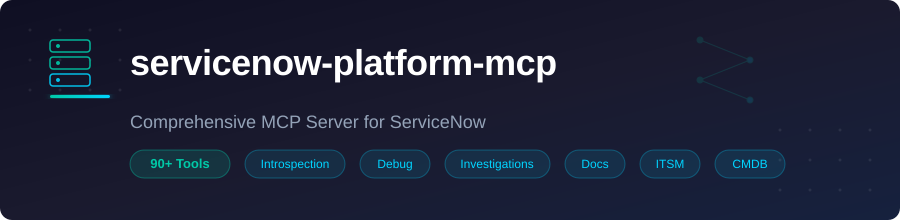

<p align="center">
  
</p>

<p align="center">
  <a href="https://pypi.org/project/servicenow-platform-mcp/"></a>
  <a href="https://pypi.org/project/servicenow-platform-mcp/"></a>
  <a href="https://github.com/Xerrion/servicenow-platform-mcp/blob/main/LICENSE"></a>
</p>

# servicenow-platform-mcp

A comprehensive [Model Context Protocol (MCP)](https://modelcontextprotocol.io/) server for ServiceNow. Provides 10 unified tools for platform introspection, change intelligence, debugging, record management, and automated investigations.

## Quick Start

**1. Set environment variables:**

```bash
export SERVICENOW_INSTANCE_URL=https://your-instance.service-now.com
export SERVICENOW_USERNAME=admin
export SERVICENOW_PASSWORD=your-password
```

**2. Run the server:**

```bash
uvx servicenow-platform-mcp
```

**3. Connect your MCP client** (see [Configuration](#configuration) below).

## Configuration

### OpenCode

Add to `~/.config/opencode/opencode.json`:

```json
{
  "mcp": {
    "servicenow": {
      "type": "local",
      "command": ["uvx", "servicenow-platform-mcp"],
      "environment": {
        "SERVICENOW_INSTANCE_URL": "https://your-instance.service-now.com",
        "SERVICENOW_USERNAME": "admin",
        "SERVICENOW_PASSWORD": "your-password"
      }
    }
  }
}
```

### Claude Desktop

Add to `claude_desktop_config.json`:

```json
{
  "mcpServers": {
    "servicenow": {
      "command": "uvx",
      "args": ["servicenow-platform-mcp"],
      "env": {
        "SERVICENOW_INSTANCE_URL": "https://your-instance.service-now.com",
        "SERVICENOW_USERNAME": "admin",
        "SERVICENOW_PASSWORD": "your-password"
      }
    }
  }
}
```

### VS Code / Cursor

Add to `.vscode/mcp.json`:

```json
{
  "servers": {
    "servicenow": {
      "command": "uvx",
      "args": ["servicenow-platform-mcp"],
      "env": {
        "SERVICENOW_INSTANCE_URL": "https://your-instance.service-now.com",
        "SERVICENOW_USERNAME": "admin",
        "SERVICENOW_PASSWORD": "your-password"
      }
    }
  }
}
```

### Generic stdio

```bash
SERVICENOW_INSTANCE_URL=https://your-instance.service-now.com \
SERVICENOW_USERNAME=admin \
SERVICENOW_PASSWORD=your-password \
uvx servicenow-platform-mcp
```

## Environment Variables

| Variable | Description | Default | Required |
|----------|-------------|---------|----------|
| `SERVICENOW_INSTANCE_URL` | Full URL (must start with `https://`) | - | Yes |
| `SERVICENOW_USERNAME` | ServiceNow username | - | Yes |
| `SERVICENOW_PASSWORD` | ServiceNow password | - | Yes |
| `MCP_TOOL_PACKAGE` | Tool package to load (`full`, `readonly`, `core_readonly`, `none`) | `full` | No |
| `SERVICENOW_ENV` | Environment label (`dev`/`test`/`staging`/`prod`) | `dev` | No |
| `MAX_ROW_LIMIT` | Max rows per query (1-10000) | `100` | No |
| `LARGE_TABLE_NAMES_CSV` | Tables requiring date filters | `syslog,sys_audit,sys_log_transaction,sys_email_log` | No |
| `SCRIPT_ALLOWED_ROOT` | Root dir for `script_path` in artifact write | `""` (disabled) | When using `script_path` |
| `SENTRY_DSN` | Sentry DSN for error reporting | `""` | No |
| `SENTRY_ENVIRONMENT` | Sentry environment label | Falls back to `SERVICENOW_ENV` | No |

The server reads from `.env` and `.env.local` files automatically.

## AI Agent Setup

Copy and paste this prompt to your AI agent (Claude Code, Cursor, OpenCode, etc.):

```
Install and configure servicenow-platform-mcp by following the instructions here:
https://raw.githubusercontent.com/Xerrion/servicenow-platform-mcp/refs/heads/main/INSTALL.md
```

Or read the [Installation Guide](INSTALL.md) directly. For usage examples and patterns, see [Agent Recipes](docs/agent-recipes.md).

## Key Features

- **Platform Introspection** - Describe table schemas with `describe` and query records with `query` using encoded queries.
- **Record Management** - Unified `record_write` and `record_apply` tools for create, update, and delete with a mandatory preview-then-apply safety pattern.
- **Artifact Management** - Write 17 artifact types (Business Rules, Script Includes, etc.) via `record_write` with local script file support.
- **Attachment Operations** - Unified `attachment` for read operations and `attachment_write` for mutations.
- **Investigations** - Automated analysis of system health, stale automations, performance bottlenecks, and more via `investigate`.
- **Label Resolution** - Map human-readable choice labels to underlying values automatically with `resolve_choice`.
- **Service Catalog** - Dispatcher-based `service_catalog` tool for browsing and ordering.

## Example Usage

### Describe a Table
```python
await describe(table="incident")
```

### Query Records
```python
# Fetch high priority incidents using an encoded query
await query(
    table="incident",
    encoded_query="active=true^priority=1",
    fields="number,short_description,priority"
)
```

## Tool Packages

Control which tools are loaded with `MCP_TOOL_PACKAGE`.

| Package | Tools | Description |
|---------|-------|-------------|
| `full` | 10 | All 10 unified tools (default) |
| `readonly` | 7 | Includes `attachment_write` (gate_write blocks in prod) |
| `core_readonly` | 5 | Minimal read surface (includes `attachment_write`) |
| `none` | 1 | Just `list_tool_packages` |

Custom packages are supported via comma-separated tool names: `MCP_TOOL_PACKAGE="query,describe,attachment"`.

## Safety

- **Table Deny List** - Blocks access to sensitive system tables (`sys_user_has_password`, `sys_credentials`, etc.).
- **Sensitive Field Masking** - Passwords, tokens, and secrets are automatically masked in responses.
- **Write Gating** - All mutations are blocked when `SERVICENOW_ENV` is set to `prod` or `production`.
- **Query Safety** - Enforces row limits and mandatory date filters on high-volume system tables.

These guardrails reduce risk but are not a guarantee - always validate in a sub-production environment.

See the [Safety & Policy](https://github.com/Xerrion/servicenow-platform-mcp/wiki/Safety-and-Policy) wiki page for complete details.

## Development

```bash
git clone https://github.com/Xerrion/servicenow-platform-mcp.git
cd servicenow-platform-mcp
uv sync --group dev
uv run pytest                  # Run tests
uv run ruff check .            # Lint
uv run ruff format .           # Format
uv run mypy src/               # Type check
```

## License

[MIT](LICENSE)
